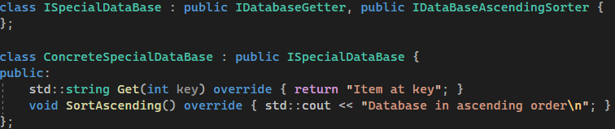

# Example
## Context

Taking ISP to the extreme would mean a single function per interface. This will ensure that we adhere to the ISP. The downside is that these single function interfaces make our depedency injection 'model' more difficult. Injecting multiple times the same object into different interfaces increases API complexity, testability effort and is redudant. 

How can we solve this problem? 

We can use the single function interfaces to compose larger interfaces, which brings flexibility and reusability. This way we could compose the ideal interface for each 'using' client. 

Does this strategy bring any disadvantage?

## Database example

Let's say we have a database class that is composed of the following publicically accessible functions:

We have two different 'using' clients of this database class, namely:
 * A **SortingClient** that only uses the sort functions of the database class
 * A **AccessorClient** that only uses the accessor functions of the database class

 According to the ISP we should not let both clients use the **ConcreteDataBase** implementation, otherwise the clients will dependent on functions they do not use. 
 
 Should we divide the concrecte implementation into a sorting and accessing part? 
 
 If we do, we will adhere more to the single responsibility principle, but for sake of simplicity we want to have a single access point to our database. What we will do instead is seperate the responsiblity on the interface level. The following interfaces are created:

The 'using' clients will look like so:

ISP has been applied: none of our clients depedent up-on functions they do not use. What happens if we would 'over engineer' here? We decide to introduce extreme reusability in our interfaces, like so:

This does not change anything from the 'using' client perspective. It only adds extra flexibility in reusing the 'single function' interfaces in other composite interfaces. A first noticable disadvantage is that readability descreases, because the interface is more scattered. Is this the only disadvantage or is there more?

Let's introduce a complete new database class that can only be read and sorted in ascending order:

This 'special' database will be used by a complete different client. We reused the single function interface **IDatabaseGetter** and **IDataBaseAscendingSorter** to compose this new interface. In this example we assume that the 'using' client of this **ISpecialDataBase** is depedent on the complete interface:

We now adhere to ISP and have the 'extreme' reusability of these single function interfaces.

What happens if we try to navigate and see which concrete implementation is actually behind the **Get** function of the interface? We will get the following options:

 It does not seem like a problem on small scale, but it will be on large scale. Let's say we introduce new interfaces and keep composing these composite interfaces from smaller interfaces. The search mechanism within our IDE will find more and more matches, because all the 'composite' interfaces will point to the single function interfaces. You can see how this eventually can result in a searching 'hell'. 

How could we have done differently?

Not applying ISP to the extreme would have meant we had two high cohesive interfaces:
 * A **SortingClient** that only uses the sort functions of the database class
 * A **AccessorClient** that only uses the accessor function of the database class

However, these interfaces don't fit our new use-case: **SpecialDatabase**. What we instead could have done is just introduce a complete new interface:

Searching for the **Get** implementation within our **SpecialDatabaseClient** will now directly point to the correct concrete implementation. This way we do not have to spend time on searching and concluding which concrete implementation belongs to the used interface.

## Conclusion
Applying ISP to the 'extreme' would mean a single function per interface. This brings reusability and makes us fully comply with ISP. However, the complexity of our codebase increases. More concrete implementations will implement the same interface, resulting in a codebase that is hard navigate through. In addition, our interfaces will be scattered, resulting in a decrease in readability. Navigating and readability helps us understand the code intent more quickly, reducing the time spent on a new feature or bug. 